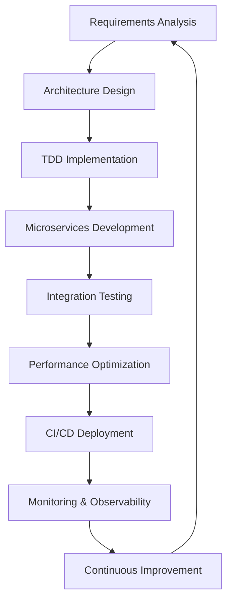

<div align="center">


</div>

> *"Arquitecto de soluciones escalables con IA integrada y microservicios distribuidos"*

---

## 🧠 Perfil Técnico

**Software Architect** especializado en **arquitecturas distribuidas**, **inteligencia artificial** y **sistemas escalables**. Con experiencia comprobada en el desarrollo de aplicaciones complejas desde el diseño de microservicios hasta la implementación de modelos de machine learning en producción.

🎯 **Enfoque Actual**: Arquitecturas de microservicios, AI/ML Integration, Cloud-Native Development  
🌟 **Especialización**: Event-Driven Architecture, Computer Vision, Real-time Systems  
🚀 **Objetivo**: Liderar equipos técnicos en la construcción de productos digitales innovadores

---

## 🏗️ Arquitectura & Especialización

<table>
<tr>
<td valign="top" width="50%">

### **🔮 Inteligencia Artificial & ML**


- **Computer Vision**: Detección de enfermedades en plantas
- **Neural Networks**: MobileNetV2, Transfer Learning
- **Model Deployment**: TensorFlow Lite, FastAPI
- **Data Processing**: Pandas, NumPy, OpenCV

</td>
<td valign="top" width="50%">

### **🏛️ Arquitectura de Software**


- **Event-Driven Architecture**: RabbitMQ, Message Queues
- **Container Orchestration**: Kubernetes, Docker Compose
- **Service Mesh**: Microservices Communication
- **Cloud Deployment**: Railway, Multi-environment

</td>
</tr>
</table>

### **💻 Stack Tecnológico Completo**

#### **Backend & APIs**


#### **Frontend & Mobile**


#### **Bases de Datos & Message Brokers**


#### **Testing & Quality**


---

## 🌟 Proyectos Técnicos Destacados

### 🤖 [AI Plant Disease Recognition System](https://github.com/EdJGM/App-Reconocimiento-Enfermedades-Plantas-IA)
**Aplicación móvil con IA para detección de enfermedades en plantas**
```yaml
Tech Stack: Flutter + FastAPI + TensorFlow + OpenCV
Architecture: Mobile-first AI Application
AI Model: MobileNetV2 + Transfer Learning
Performance: <2s prediction time, 50MB app size
Features:
  - Computer Vision con TensorFlow Lite
  - API REST con FastAPI y procesamiento de imágenes
  - Base de datos SQLite local con historial
  - Soporte multiidioma (ES/EN)
  - Containerización con Docker
```

### 🌾 [AgroFlow - Microservices Agriculture System](https://github.com/EdJGM/AgroFlow-MS-Gestion-Agricola)
**Sistema distribuido de microservicios para gestión agrícola integral**
```yaml
Architecture: Event-Driven Microservices
Tech Stack: Spring Boot 3.2 + RabbitMQ + PostgreSQL + MySQL
Services:
  - Central Service (Port 8080): Agricultores, Cosechas, Event Publisher
  - Billing Service (Port 8082): Facturas automáticas, QR Codes
  - Inventory Service (Port 8081): Stock management, Alertas
Message Broker: RabbitMQ con Topic Exchange
Deployment: Docker + Kubernetes + Ingress Controller
Database Strategy: Polyglot persistence (PostgreSQL + MySQL)
```

### 🔄 [Advanced TDD & Testing Framework](https://github.com/EdJGM/TDDTestingMVC)
**Implementación completa de TDD con múltiples niveles de testing**
```yaml
Framework: ASP.NET Core MVC + .NET 8
Testing Strategy:
  - Unit Tests: xUnit + FluentAssertions
  - Integration Tests: ASP.NET Core TestServer
  - BDD Tests: Reqnroll (SpecFlow successor)
  - E2E Tests: Selenium WebDriver (Chrome/Edge/Firefox)
  - Reporting: ExtentReports
Coverage: Models, Controllers, Business Logic, UI Flows
CI/CD: Automated testing pipeline
```

### 💬 [Real-time Chat System with WebSockets](https://github.com/EdJGM/ChatSala-WebSocket)
**Sistema de chat en tiempo real con fingerprinting y salas temporales**
```yaml
Architecture: Real-time WebSocket Architecture
Frontend: React 19 + TypeScript + TailwindCSS + Radix UI
Backend: Node.js + Express + Socket.IO
Features:
  - Device Fingerprinting para identificación única
  - Salas temporales con PIN de 6 dígitos
  - Panel de administración completo
  - Conexión única por dispositivo
  - Auto-cleanup de salas inactivas
Security: CORS, Device-based access control
```

### 📱 [Flutter Authentication API](https://github.com/EdJGM/FlutterAuth-API)
**Sistema completo de autenticación móvil con JWT**
```yaml
Mobile: Flutter + Dart
Backend: FastAPI + JWT + SQLAlchemy
Security: Token-based authentication, Password hashing
Database: PostgreSQL con ORM
Features: Register, Login, Profile management
API Documentation: OpenAPI/Swagger auto-generated
```

### 🎮 [Godot Game Development](https://github.com/EdJGM/Juego-Godot)
**Desarrollo de videojuegos con Godot Engine**
```yaml
Engine: Godot 4.x
Language: GDScript
Game Type: 2D/3D game development
Features: Physics, Animation, Scene management
```

---

## 🏛️ Expertise en Arquitectura

```python
class SoftwareArchitect:
    def __init__(self):
        self.microservices = {
            "patterns": ["Event-Driven", "CQRS", "Saga Pattern"],
            "messaging": ["RabbitMQ", "Apache Kafka", "Message Queues"],
            "databases": ["Polyglot Persistence", "RDBMS", "NoSQL"],
            "deployment": ["Kubernetes", "Docker", "Service Mesh"]
        }
        
        self.ai_ml = {
            "frameworks": ["TensorFlow", "PyTorch", "scikit-learn"],
            "computer_vision": ["OpenCV", "Image Classification", "Object Detection"],
            "deployment": ["TensorFlow Lite", "ONNX", "Model Serving"],
            "data_processing": ["Pandas", "NumPy", "Data Pipelines"]
        }
        
        self.mobile_development = {
            "frameworks": ["Flutter", "React Native"],
            "languages": ["Dart", "TypeScript", "Kotlin"],
            "features": ["Camera API", "Local Storage", "Real-time Sync"]
        }
    
    def architectural_principles(self):
        return {
            "🧩 Modularity": "Microservices desacoplados con responsabilidades únicas",
            "📡 Event-Driven": "Comunicación asíncrona mediante eventos",
            "🔄 Resilience": "Circuit breakers, timeouts, retry policies",
            "📈 Scalability": "Auto-scaling horizontal y vertical",
            "🔒 Security": "OAuth2, JWT, API Gateways, Rate Limiting",
            "📊 Observability": "Logging, Monitoring, Distributed Tracing"
        }
```

---

## 🛠️ Competencias Técnicas Avanzadas

### **🎯 Especialización en Testing**
- **TDD (Test-Driven Development)**: Desarrollo guiado por pruebas
- **BDD (Behavior-Driven Development)**: Reqnroll/SpecFlow
- **Test Automation**: Selenium WebDriver, multi-browser testing
- **Performance Testing**: Load testing, stress testing
- **CI/CD Integration**: Automated testing pipelines

### **🤖 Inteligencia Artificial & ML**
- **Computer Vision**: Clasificación de imágenes, detección de objetos
- **Model Training**: Transfer Learning, Fine-tuning
- **Model Optimization**: TensorFlow Lite, quantization
- **MLOps**: Model versioning, deployment, monitoring
- **Data Engineering**: ETL pipelines, data preprocessing

### **🏗️ Arquitectura de Sistemas**
- **Microservices Design**: Domain-driven design, service boundaries
- **Event-Driven Architecture**: Message brokers, event sourcing
- **API Design**: RESTful APIs, GraphQL, API versioning
- **Database Design**: Polyglot persistence, ACID compliance
- **Cloud Architecture**: Container orchestration, serverless

---

## 🌐 Proyectos Adicionales Relevantes

<details>
<summary><b>🔥 Ver más proyectos técnicos</b></summary>

### 🤖 [Alexa Skill Development](https://github.com/EdJGM/SkillAlexa)
**Custom Alexa Skills con integración de APIs**

### 💰 [Financial Management System](https://github.com/EdJGM/App-Sistema-Gestion-Financiera)
**Sistema completo de gestión financiera empresarial**

### 🔧 [System Information Tool](https://github.com/EdJGM/SystemInfo)
**Herramienta de monitoreo y diagnóstico del sistema**

### 📚 [Academic Publications Microservices](https://github.com/EdJGM/Microservicios-Publicaciones-Academicas)
**Sistema distribuido para gestión de publicaciones científicas**

### 🌱 [Environmental Monitoring Microservice](https://github.com/EdJGM/MS-GestionMonitoreoAmbiental)
**Microservicio para monitoreo ambiental IoT**

### 🤖 [Administrative Chatbot Panel](https://github.com/EdJGM/chatbot-admin-panel)
**Panel de administración para gestión de chatbots**

</details>

---

## 📈 Filosofía de Desarrollo

<div align="center">



</div>

**Principios Fundamentales:**
- 🧪 **Test-First Development**: TDD como metodología principal
- 🏗️ **Clean Architecture**: Separación de responsabilidades
- 🔄 **Continuous Integration**: Automatización de pipelines
- 📊 **Data-Driven Decisions**: Métricas y monitoreo constante
- 🚀 **Performance-First**: Optimización desde el diseño

---

## 🤝 Conecta Conmigo

<div align="center">

[](https://github.com/EdJGM)
[](https://www.linkedin.com/in/edgar-josue-gallegos-meza-9815b7300/)
[](ejgallegos@espe.edu.ec)

</div>

---

<div align="center">
  
</div>

<div align="center">
  
**🎯 "La arquitectura de software es el arte de tomar decisiones técnicas que permitan que el sistema evolucione"**

*Available for challenging technical leadership roles and complex software architecture projects*


</div>
